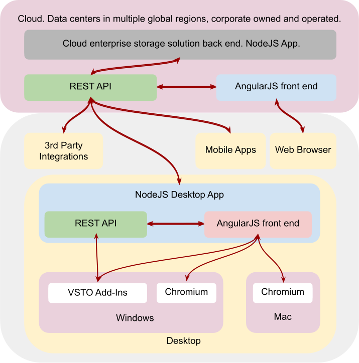

# DivocOffice
Functional Office VSTO Add-ins for Outlook, Word, PowerPoint and Excel

## Purpose

* Build functional add-ins that demonstrate a business process
* Mock functionality of existing cloud storage product's desktop Office integration
* Learn some new things along the way

## Architecture of existing Enterprise Cloud Storage Solution and its Desktop Office Integration

### Enterprise Cloud Storage Solution Overview

### Desktop Office Integration Overview

## Set-up

### Visual Studio 2019

* VS2017 may work

### Back-end

* Register for the Microsoft 365 Developer program or use your existing Azure/Sharepoint/etc set-up (not recommended)
* Set up your default Sharepoint site as you like. Make sure there is a default library. Add some folders and documents.

### Install Desktop Office Apps

There are a few different ways, chose the best for you.

### Environment Variables (User)

* `DIVOC_INSTANCE` (Most likely: https://login.microsoftonline.com/)
* `DIVOC_TENANT` (Your tentant url)
* `DIVOC_CLIENTID` (Application ClientId generated in your [Azure app registration](https://docs.microsoft.com/en-us/azure/active-directory/develop/quickstart-register-app))

## References and Resources

* Helmut Overtanner: [Outlook VSTO](https://www.codeproject.com/Articles/21288/Customize-the-built-in-Outlook-Select-Names-dialog) (I think this is based off the much much older C++ example from Ken Slovak, if memory serves)
* [MSAL Authentication & Caching] (https://github.com/AzureAD/microsoft-authentication-library-for-dotnet/wiki/token-cache-serialization) (and a few others, all variations on the same code)